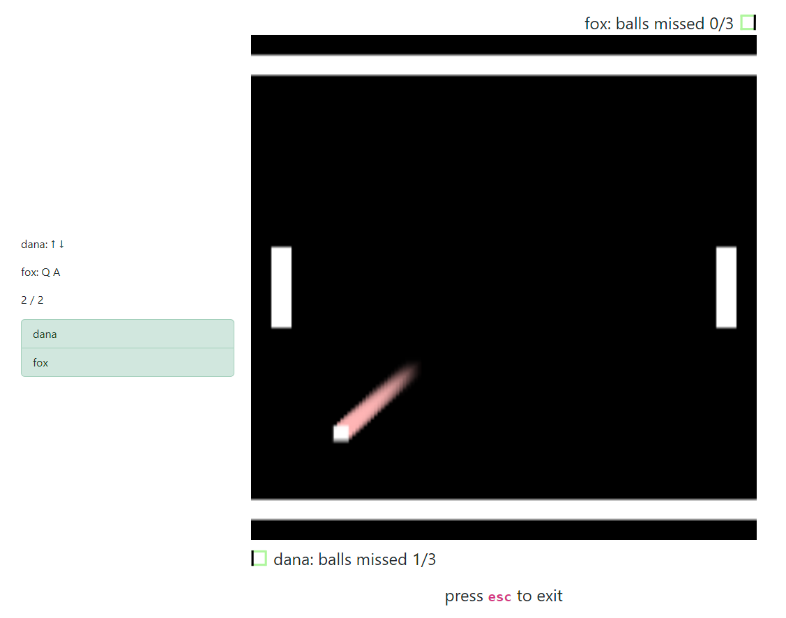

  <h2 align="center">transcendence</h3>

<!-- ABOUT THE PROJECT -->
## About the project

This is a website mainly built with Django and Javascript, and it utilizes a PostgreSQL database through the Django ORM. The UI/frontend is very simplistic, but the backend is quite beefy. We're using websockets to facilitate the multiplayer functionality

how stuff works:
- You can choose to either play a single match or in a tournament
- Two players can play on the same computer
- The backend treats a another player from another computer the same as a another player from the same computer
- In non-tournaments you can also choose to play against an AI
- The tournament is a simple single-elimination tournament, the players are randomly matched against each other and the winner of each match continues
- In the tournament you die from one ball passed, but in a single match you get three lives

## How to deploy with Docker Compose

1. Clone the repository using `git clone https://github.com/flowerbuddies/transcendence.git`
1. `cd transcendence`
1. Copy the `.env.example` into `.env`
1. Fill the `.env`-file values as necessary
1. Run `docker compose up --build -d`
1. Navigate to https://localhost:8443 and enjoy! (Note: There is a warning generated due to a self-signed certificate)
1. To shut it down, run `docker compose down` in the project folder

## How to get basic information using the CLI

- Get the list of lobbies: `curl -k 'https://<domain_name>:8443' -H 'Accept: application/json'`
- Get information about a lobby using its name: `curl -k 'https://<domain_name>:8443/game?name=<name_of_the_lobby>' -H 'Accept: application/json'`

(note: replace domain_name and name_of_the_lobby if that wasn't clear)
